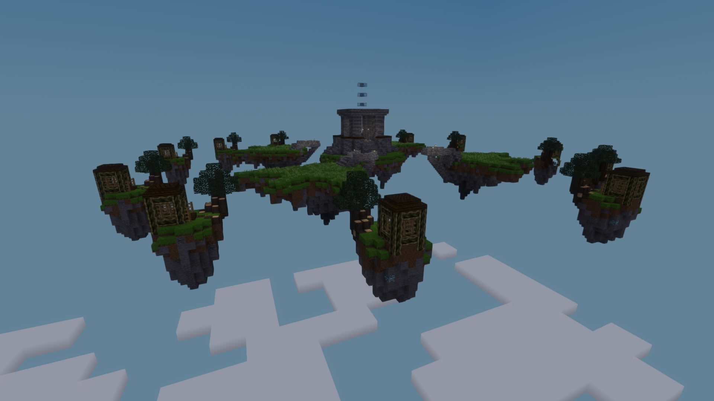

# Mini-Game Version [0.0.1-bis]

## Installation

1. Ensure you have Luanti installed. You can download it from [Luanti's official website](https://www.minetest.net/downloads/).

2. Download [Minetest Game](https://github.com/minetest/minetest_game/) into your `game` directory.

3. Clone or download this mod into your Minetest `mods` directory.

## How to play

- Host a new world.
- Ensure the mod is enabled.
- Run `/join`.

The game requires at least two players.

**Have fun!**